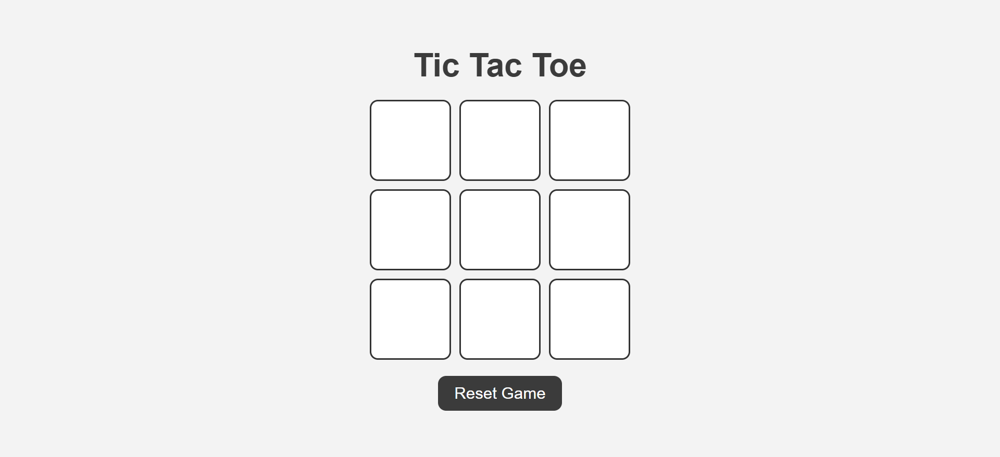

# Tic Tac Toe Game

A user-friendly, interactive Tic Tac Toe game built using **HTML**, **CSS**, and **JavaScript**. This game allows two players to take turns, provides instant feedback on the game status (win or draw), and offers a sleek, minimalistic design. It is fully responsive, ensuring a smooth gaming experience across different devices.

## 🎮 Demo Screenshot



## 🔗 Live Demo

Play the game live here: **[Tic Tac Toe Game Live Demo](https://premkrrajbhar.github.io/tic-tac-toe-game/)**

## 📋 Features

- **Player Turns**: Alternates between Player X and Player O on each click.
- **Winner Detection**: Automatically detects when a player has won by completing a row, column, or diagonal.
- **Draw Detection**: If all boxes are filled without a winner, the game declares a draw.
- **Reset Functionality**: The game can be reset using a button to start a new round.
- **Popup Result**: Displays a popup with the winner or draw message after the game ends.
- **Responsive Design**: Optimized for desktops, tablets, and mobile devices, ensuring a smooth experience on any screen size.
- **User-Friendly Interface**: Simple and intuitive UI with clear buttons and grid layout, perfect for quick and easy gameplay.

## 🛠️ Technologies Used

- **HTML**: Provides the structure and layout of the game board.
- **CSS**: Styles the game interface, ensuring a clean and modern design.
- **JavaScript**: Implements the game logic, including turn tracking, winner detection, draw check, and game reset.

## 💻 How to Play

- **Start the Game**: Open the `index.html` file in your browser to begin.
- **Make a Move**: Click on an empty square to make a move. Player X goes first.
- **Win or Draw**: The game will automatically detect if a player wins or if the game ends in a draw.
- **Reset the Game**: Click the **"Reset Game"** button to start a new round with an empty board.
- **Game Result**: Once the game ends, a popup will show the result with the option to play a new game.

## 📝 How to Run Locally

- Step 1: Clone the repository:

   ```bash
   git clone https://github.com/premkrrajbhar/tic-tac-toe-game.git
   ```

- Step 2: Navigate to the project folder:

   ```bash
   cd tic-tac-toe-game
   ```

- Step 3:  Open the `index.html` file in your web browser to start the game.

## 🤝 Contributing

Contributions are welcome! Feel free to submit a pull request or open an issue for any suggestions or improvements.

## 📞 Contact

For any questions or feedback, please reach out to:

- **Email**: [premkumar224487@gmail.com](mailto:premkumar224487@gmail.com)
- **GitHub**: [premkrrajbhar](https://github.com/premkrrajbhar)
